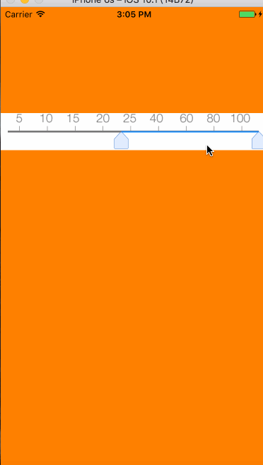

# RulerIndicator
进度导航条
>**描述**

- 根据导航条两端的滑动来获得进度的数值，获得的进度数值由内部的block来返回
- 可以随意设置视图的大小，并可以规定进度条的最大值和最小值，也可以规定最小的间隔值

>**效果图**

- 

>**使用方法**

- 1.导入头文件
    - #import "RulerView.h"
- 2.添加视图

```
RulerView *rulerView = [[RulerView alloc] initWithFrame:CGRectMake(0, 150, self.view.bounds.size.width, self.view.bounds.size.height)];  

rulerView.backgroundColor = [UIColor whiteColor];

rulerView.valueBlock = ^(CGFloat leftvalue, CGFloat rightValue){
        NSLog(@"%lf------%lf",leftvalue,rightValue);
    };

[self.view addSubview:rulerView];

```
- 3.如果需要设置其他参数，请依次设置一下参数

```
rulerView.maxValue = 100.f;
rulerView.minValue = 0.f;
rulerView.minRegion = 5.f;
```


